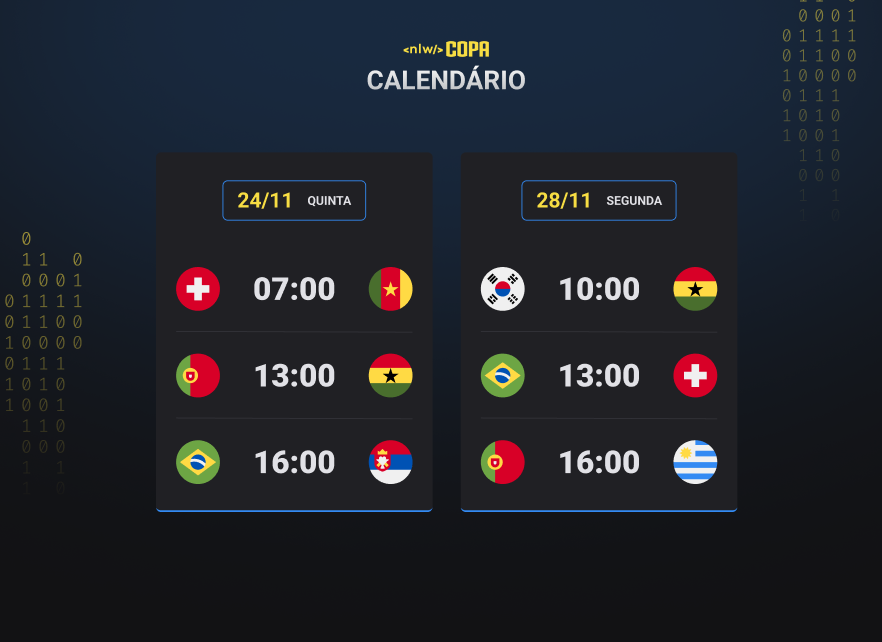

<h1 align="center">NLW #10 Copa</h1>

 Evento promovido pela Rockeseat

 
        <a href="#-tecnologias">Tecnologias</a>&nbsp;&nbsp;&nbsp;&nbsp;&nbsp;&nbsp;
        <a href="#-projeto">Projeto</a>&nbsp;&nbsp;&nbsp;&nbsp;&nbsp;&nbsp;
        <a href="#-layout">Projeto</a>&nbsp;&nbsp;&nbsp;&nbsp;&nbsp;&nbsp;

 

    

## 🚀 Tecnologias

Esse projeto foi desenvolvido com as seguintes tecnologias:

- HTML e CSS
- Javascript
- Git e Github 

## 💻 Projeto

O calendário da copa é um projeto que mostra os jogos da copa de 2022.

## 📄 Layout

Você pode visualizar o layout do projeto através [DESSE LINK](https://fabiohenriquefarias.github.io/NLW-copa/).

